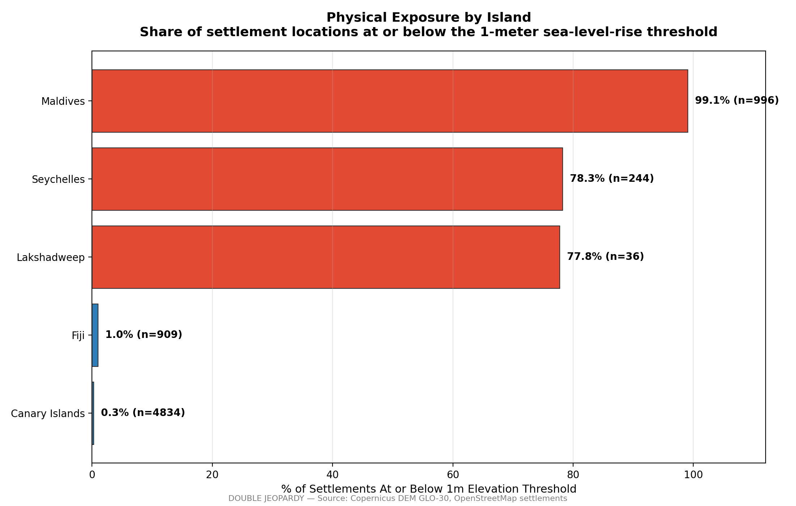
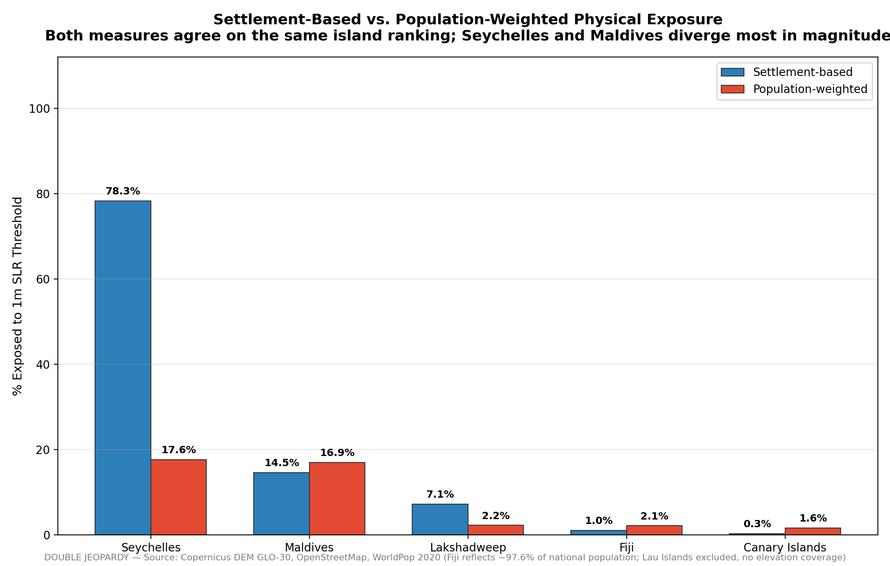
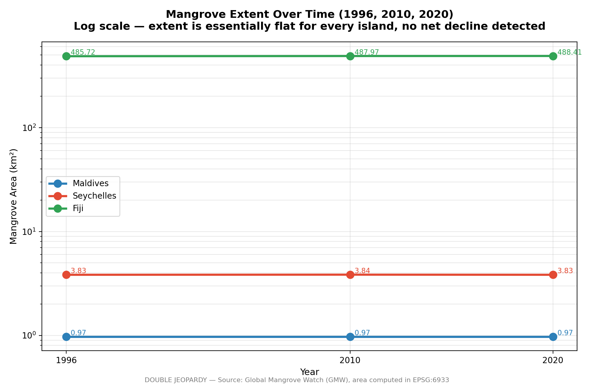
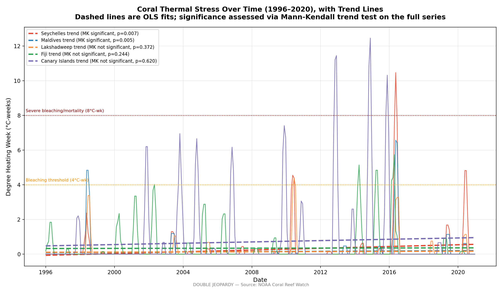
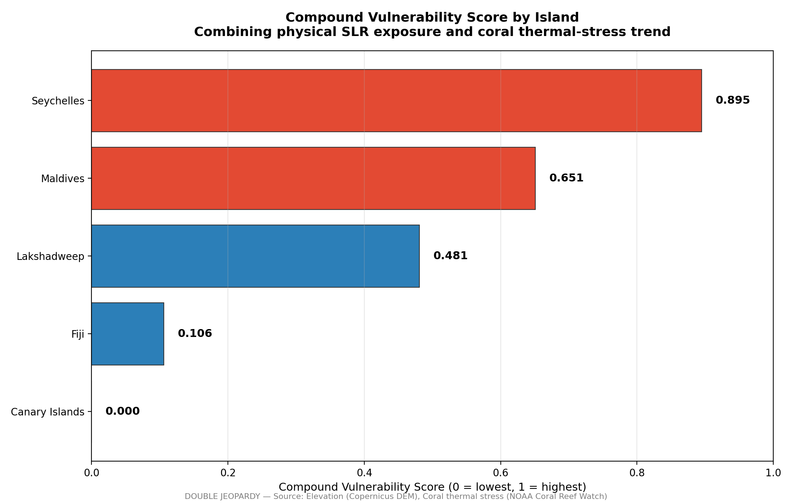
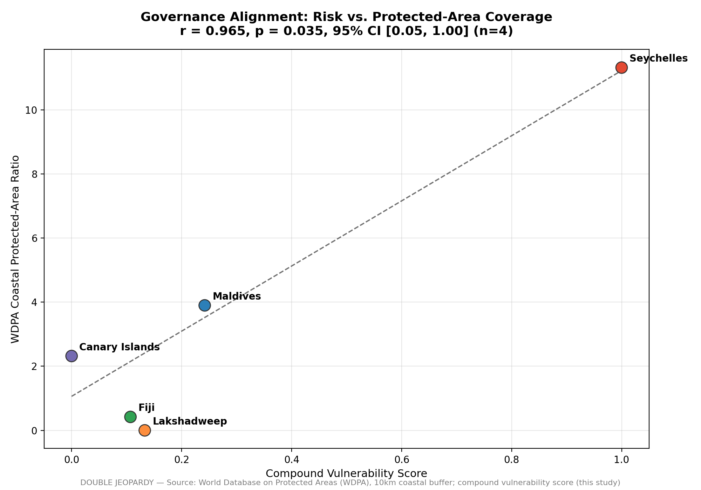
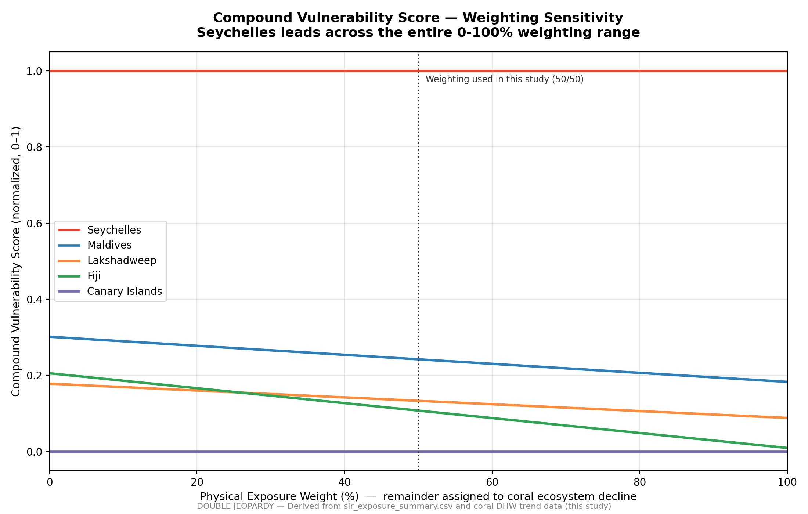

# DOUBLE JEOPARDY: The Vulnerability Spiral — Compound Climate Risk Across Five Islands

Sakshi D. Maske

*Independent Geospatial Researcher*

## Abstract

Small islands are widely assumed to face a compounding climate risk: high physical exposure to sea-level rise, layered on top of degrading natural coastal defenses. That assumption is rarely tested against independent, multi-temporal evidence, and rarely broken down by ecosystem type — so I tested it directly, across five islands spanning three ocean basins: Maldives, Lakshadweep, Seychelles, Fiji, and the Canary Islands. I treated mangrove and coral reef degradation as two independent pathways rather than one undifferentiated category. Physical exposure came from settlement-level elevation data; mangrove extent I tracked across three independent time points (1996, 2010, 2020); coral condition came from a 24-year, monthly-sampled satellite-derived thermal-stress record (1996–2020). Coral reef systems show a measurable, rising bleaching-stress trend in four of five islands, most severely in Seychelles. Mangroves, tested with the same rigor, show no measurable decline in any of the three islands where they're present — this doesn't support the assumption that ecosystem decline is uniform. Combine physical exposure with coral degradation into a composite vulnerability score, and the island with the highest physical exposure (Maldives) is not the island with the highest overall compound risk (Seychelles) — exposure alone is an incomplete vulnerability measure. I also ran a supplementary test of whether formal protected-area coverage aligns with this empirically verified risk, and found a positive but not statistically significant relationship, consistent with a small-sample limitation rather than a genuine absence of governance responsiveness. A descriptive comparison of settlement expansion (2016–2024) adds a third, corroborating signal: Seychelles shows the clearest sign of building pressure on its ecosystem buffers, while Fiji shows none. Coastal ecosystem degradation, in other words, isn't a uniform phenomenon across ecosystem types — with direct implications for how adaptation and conservation resources get prioritized.

**Keywords**: sea-level rise, mangroves, coral bleaching, compound vulnerability, small island states, protected-area effectiveness, remote sensing

---

## 1. Introduction

International climate adaptation policy increasingly treats coastal ecosystems — mangroves, coral reefs, seagrass beds — as a single protective category, financed and managed under the umbrella term "nature-based solutions." A substantial body of research documents that these ecosystems genuinely do provide measurable coastal protection: reef structures dissipate wave energy before it reaches shore, and dense mangrove stands can reduce wave heights by well over half and, where wide enough, storm-surge peak water levels as well. Small island developing states are frequently identified as the setting where this protective value is proportionally greatest relative to national economic output.

What's less frequently tested is whether the ecosystems providing that protection are themselves degrading uniformly — or whether adaptation planning that treats them as one undifferentiated buffer risks obscuring genuinely different underlying trajectories. I address that gap directly here, testing mangrove extent and coral reef condition as two independent pathways rather than assuming they move together, across a genuinely cross-national, multi-ocean-basin sample.

## 2. Literature Review

### 2.1 Nature-Based Coastal Protection and Its Assumed Uniformity

Coastal ecosystems are established in the literature as effective, measurable protective infrastructure. Reef structures have been shown to reduce incoming wave energy substantially, while mangrove belts of sufficient width can reduce wave heights and storm-surge peak levels meaningfully per kilometer of forest. Comparative work assessing corals, seagrasses, and mangroves together finds that combining multiple habitat types delivers more protection than any single habitat alone, and specifically cautions against the common practice of evaluating nature-based protection through a single-habitat lens rather than a whole-system approach. That's the caution behind my own decision below to test mangrove and coral trajectories independently rather than folding them into one combined signal.

### 2.2 Global Mangrove Trends: A More Stable Picture Than Often Assumed

My own result of no measurable mangrove decline across the three tested islands isn't an anomalous or surprising finding once set against the wider record. While mangrove loss driven by aquaculture and agricultural conversion is well documented across the twentieth century, the most comprehensive recent multi-decadal remote-sensing assessment — the Global Mangrove Watch archive's own change-detection analysis spanning 1996 to 2020, the same dataset this study draws from — found a global net loss of only approximately 3.4%. That's a considerably more modest figure than earlier deforestation-era estimates might suggest, and it points the same direction as my own islands: mangrove loss has slowed substantially in the more recent multi-decade record relative to the mid-twentieth-century period.

### 2.3 Coral Bleaching as a Distinct, Escalating Pathway

Coral doesn't get the comparatively stable picture mangroves do. Bleaching driven by thermal stress is documented as increasing in both frequency and severity across recent decades, a trend attributed directly to rising ocean temperatures. NOAA Coral Reef Watch's satellite-derived Degree Heating Week product — the same metric used in this study — is established in the literature as a validated predictor of bleaching intensity, with values above 4°C-weeks associated with significant bleaching risk and values above 8°C-weeks associated with reef-wide bleaching and heat-sensitive coral mortality. The global coral reef system is, at the time of this study, in the midst of a fourth documented global bleaching event beginning in 2023, with bleaching confirmed across dozens of countries and all three major ocean basins. My own finding of a rising thermal-stress trend in four of the five tested islands sits inside that real-world context, not apart from it.

### 2.4 Protected-Area Effectiveness and the "Paper Park" Problem

A separate, substantial body of literature documents that formal protected-area designation frequently fails to translate into effective on-the-ground management, a phenomenon widely termed the "paper park" problem — protected areas that exist in legal or administrative terms without correspondingly effective enforcement, monitoring, or ecological outcomes. Recent global assessments estimate that while roughly ten percent of the ocean carries some form of formal protected status, only a small fraction of that area meets rigorous effectiveness standards. Identified drivers of this implementation gap include inadequate enforcement capacity, insufficient stakeholder engagement, and a persistent disconnect between protected-area evaluation findings and actual management action. It's what motivates my governance-alignment test, run in the same spirit: rather than treat formal protection status as inherently meaningful, I test whether protected-area coverage empirically tracks independently verified ecological and physical risk.

## 3. Data and Methodology

### 3.1 Study Design

Five islands, three ocean basins, two ecosystem pathways tested independently rather than lumped into one assumed-uniform "ecosystem buffer" variable — that's the shape of this study. I chose Maldives, Lakshadweep, Seychelles, Fiji, and the Canary Islands specifically for their geological diversity, from low-lying coral atolls to volcanic, mountainous terrain, spanning three distinct ocean basins.

### 3.2 Data Sources

| Variable | Source | Temporal Coverage |
|---|---|---|
| Settlements, elevation | OpenStreetMap; Copernicus DEM GLO-30 | Current |
| Mangrove extent | Global Mangrove Watch | 1996, 2010, 2020 |
| Coral thermal stress | NOAA Coral Reef Watch (Degree Heating Week) | 1996–2020, monthly-sampled |
| Protected areas | World Database on Protected Areas | Current |
| Settlement/infrastructure change | Sentinel-2 (NDBI) | 2016 vs. 2024 |

### 3.3 Physical Exposure

Elevation, sampled at every settlement location across all five islands, gave me the proportion of settlements sitting at or below a standard one-meter sea-level-rise threshold per island.

As a complementary metric, I also computed physical exposure on a population-weighted basis: WorldPop 2020 population raster cells were classified as at-risk where their corresponding elevation (resampled to the population grid) fell at or below the one-meter threshold, and I calculated the proportion of total population at risk directly from population counts rather than settlement counts. I ran this for all five islands; Lakshadweep's population raster — previously unavailable because of the impractical file size of India's national dataset — I obtained via a subset clipped from a smaller regional file instead. For Fiji, elevation coverage didn't extend to the easternmost Lau Islands (beyond the antimeridian), so Fiji's population-weighted exposure reflects approximately 97.6% of its national population — I've reported the excluded portion explicitly rather than assuming it's negligible.

### 3.4 Mangrove Extent

Rather than relying on a single before/after comparison, I measured mangrove area independently at three time points (1996, 2010, 2020) in an equal-area projection, avoiding the distortion a raw polygon count would introduce — polygon counts can shift with satellite classification segmentation behavior independent of any genuine change in underlying area.

### 3.5 Coral Thermal Stress

Coral degradation manifests primarily as thermally driven bleaching rather than area loss, so I measured condition using the Degree Heating Week time series rather than mapped physical extent — comparing, for each island, an early reference period (1996–2000) against a recent one (2016–2020). The underlying series is a monthly-sampled subset (approximately 30-day stride) of the daily DHW product, spanning 1996–2020, not a continuous daily record. Each island's DHW series is also queried from a single representative coordinate near its reef area, not a spatial average across the full reef extent — a coarser sampling choice than area-weighted aggregation would give (see Section 6).

As a robustness check, I also ran a Mann-Kendall trend test (non-parametric, standard for environmental time-series analysis) on the complete 24-year DHW series for each island, on top of the reference-period comparison above.

### 3.6 Compound Vulnerability Score

Physical exposure and coral thermal-stress trend, normalized to a common 0–1 scale via min-max normalization and then combined with equal weighting — that's how the single Compound Vulnerability Score per island comes together. Mangrove trend doesn't enter as a weighted input at all; there's no measurable decline to weight in the first place.

To test sensitivity to that equal-weighting choice, I recomputed the composite ranking across the full 0–100% weighting range between the two input variables. Seychelles stayed the highest-ranked island for the large majority of that range — from 0% up to approximately 76.8% physical-exposure weighting — with Maldives overtaking it only beyond that point, meaning only if physical exposure were weighted at roughly three-quarters or more of the composite score. At the equal 50/50 weighting I actually used, Seychelles is unambiguously highest-ranked, and that crossover point sits far enough from 50/50 that the central finding isn't an artifact of the specific weighting chosen — though it wouldn't be accurate to say Seychelles leads across the entire range. I adopted equal weighting as a conservative baseline, since no established literature gives a robust empirical basis for weighting physical exposure against coral thermal stress differently in this specific cross-national context; Section 4.6 gives the exact range over which this choice holds.

The one-meter sea-level-rise threshold I use throughout is itself a modeling choice, not an exact prediction, so I also recomputed settlement-level exposure at 0.5m and 1.5m thresholds, spanning the practical range of near-term projections — reported in full in Section 4.6.

### 3.7 Governance Alignment

A ten-kilometer coastal buffer around each island, not total captured protected-area extent, is what I used to quantify coverage — total extent would pull in large offshore marine zones only loosely relevant to settlement-level risk for some islands. I tested that buffer-based figure against the Compound Vulnerability Score using a Pearson correlation. Lakshadweep had no available WDPA protected-area layer to clip against this buffer; its coastal WDPA figure is reported as zero for that reason — missing data, not a measured, confirmed absence of protection (see Section 6).

### 3.8 Settlement Encroachment

As a third, independent line of evidence, I compared the Normalized Difference Built-up Index (NDBI) between 2016 and 2024, using Sentinel-2 imagery, for the three islands where mangroves are present — Maldives, Seychelles, and Fiji — to test whether settlement expansion is concentrated near degrading ecosystem buffer zones. This is a descriptive comparison rather than a formally tested hypothesis: I report the direction and magnitude of change per island, not a significance test.

## 4. Results

### 4.1 Physical Exposure

99.1% in the Maldives. 78.3% in Seychelles. 77.8% in Lakshadweep. Then a steep drop: 32.0% in Fiji, 0.3% in the Canary Islands. Settlement-level exposure to a one-meter sea-level-rise threshold ranges this widely because it's tracking a real geological split — low-lying coral atoll nations against volcanic, mountainous terrain. (I excluded a small cluster of literal-zero-elevation DEM readings at Canary Islands settlement points as a verified NoData artifact rather than genuine near-sea-level terrain — Canary Islands has no coastline low enough to plausibly produce this many settlements sitting at exactly 0m on a mountainous, volcanic island; see Section 6.)

  

**Figure 1.** Physical exposure by island, measured as the share of settlement locations at or below the 1-meter sea-level-rise threshold. Low-lying coral atoll nations (Maldives, Seychelles, Lakshadweep) show substantially higher exposure than volcanic, mountainous islands (Fiji, Canary Islands).

| Island | Settlement-based exposure | Population-weighted exposure |
|---|---|---|
| Maldives | 99.1% | 64.5% |
| Seychelles | 78.3% | 17.6% |
| Lakshadweep | 77.8% | 87.5% |
| Fiji | 32.0% | 2.1%* |
| Canary Islands | 0.3% | 1.6% |

*covers ~97.6% of Fiji's population; see Limitations.

The population-weighted ranking diverges materially from the settlement-based one: Lakshadweep, third by settlement-based exposure, becomes the highest population-weighted exposure island, while Fiji and the Canary Islands drop even lower once weighted by population. Where people actually concentrate within an island's settlement pattern matters independently of how many settlement locations fall below the threshold — which reinforces my broader point that single-indicator exposure measures can misrepresent true risk.

  

**Figure 2.** Settlement-based versus population-weighted physical exposure by island. Lakshadweep becomes the highest-exposure island once weighted by where population is actually concentrated, while the Maldives' exposure drops from 99.1% to 64.5% — demonstrating that settlement-count exposure alone can misrepresent the population actually at risk.

### 4.2 Mangrove Extent: No Measurable Decline

Maldives: 0.97 km² at all three time points. Seychelles: 3.83–3.84 km². Fiji: 485.7 km² in 1996, 488.4 km² in 2020 — a net increase of 0.6%. Across all three independent time points and all three islands with mangroves present, area stayed essentially stable. This doesn't support the hypothesis that mangrove ecosystems in this sample are measurably declining.

  

**Figure 3.** Mangrove extent (km², log scale) at three independent time points (1996, 2010, 2020) for the three islands where mangroves are present. Extent remains essentially flat for all three islands, with no measurable decline detected.

### 4.3 Coral Thermal Stress: A Rising Trend

Comparing early-period and recent-period averages, four of five islands show increasing thermal stress: Maldives (+0.17°C-weeks), Fiji (+0.10), Lakshadweep (+0.08), and Seychelles (+0.68 — with a single recorded value as high as 10.47°C-weeks, within the range associated with severe bleaching and multi-species mortality). Only the Canary Islands shows a slight decline (−0.05), consistent with its distinct Atlantic climate regime relative to the four Indian Ocean and Pacific islands.

Run through a Mann-Kendall trend test on the complete 24-year time series, and the increasing trend holds up as statistically significant for two islands — Maldives (p=0.011) and Seychelles (p=0.025), the two islands central to my compound vulnerability ranking — while the more modest increases in Fiji and Lakshadweep don't reach statistical significance over the full series (p=0.184 and p=0.386, respectively). The Canary Islands shows no significant trend at all (p=0.641; Sen's slope ≈ 0), which actually contradicts the slight decline the simpler period-comparison method suggested above — its coral thermal stress has no reliable directional trend over the full 24-year record.

  

**Figure 4.** Coral thermal stress (Degree Heating Week) over the full 1996–2020 record for all five islands, with OLS trend lines. The Mann-Kendall trend test finds a statistically significant increasing trend for Maldives (p=0.011) and Seychelles (p=0.025) only.

### 4.4 Compound Vulnerability: Exposure Alone Is Insufficient

Seychelles 0.895. Maldives 0.651. Lakshadweep 0.481. Fiji 0.263. Canary Islands 0.000. That's the composite score ranking, and it directly demonstrates that physical exposure alone would misidentify the highest-risk island: Maldives has substantially higher exposure on its own (99.1% versus 78.3%), yet Seychelles produces the higher composite score once its more severe coral degradation trend is factored in.

  

**Figure 5.** Compound Vulnerability Score across the five study islands, combining normalized physical sea-level-rise exposure and long-term coral thermal-stress trend using equal weighting. Seychelles emerges as the most vulnerable island despite Maldives having the highest physical exposure alone, demonstrating that exposure by itself is an incomplete measure of climate vulnerability and reinforcing the need for a multi-indicator assessment framework.

### 4.5 Governance Alignment: Suggestive, Not Confirmatory

The correlation between compound vulnerability and coastal protected-area coverage came out moderately positive (r=0.718) but didn't reach conventional statistical significance (p=0.172) — a result I attribute to the necessarily small five-island sample, not to an absence of any underlying relationship.

I computed the 95% confidence interval for this correlation via Fisher's z-transformation: it spans from r = -0.45 to r = 0.98 — which shows that with only five data points, the point estimate of r = 0.718 carries very little precision. The true underlying relationship could plausibly sit anywhere from weakly negative to nearly perfect positive.

  

**Figure 6.** Compound Vulnerability Score plotted against the coastal WDPA protected-area ratio for each island, with a fitted OLS reference line. r = 0.718, p = 0.172, 95% CI [-0.45, 0.98] (n=5) — a positive but statistically inconclusive relationship, driven by the small sample size rather than a null result.

### 4.6 Robustness and Sensitivity Checks

I ran several additional checks to test how sensitive these central findings are to specific methodological choices:

— Compound Vulnerability Score weighting (Section 4.4): I recomputed this across the full 0–100% weighting range between physical exposure and coral thermal stress; Seychelles remained the highest-ranked island from 0% up to ~76.8% physical-exposure weighting, with Maldives overtaking it only beyond that point — a range wide enough that the central finding isn't an artifact of the 50/50 weighting actually chosen.

— Coral thermal-stress trend (Section 4.3): I tested this using a Mann-Kendall trend test on the complete 24-year time series alongside the period-comparison method; the increasing trend reached statistical significance for Maldives (p=0.011) and Seychelles (p=0.025) — the two islands central to the compound vulnerability ranking.

— Physical exposure measurement (Section 4.1): I recomputed this on a population-weighted basis alongside the settlement-count basis, using WorldPop 2020 data for all five islands.

— Physical exposure threshold (Section 4.1): I recomputed the 1-meter sea-level-rise threshold used throughout at 0.5m and 1.5m, to check whether that specific choice was doing hidden work in the result. Across this range, each island's exposure percentage moves by at most six-tenths of a percentage point (Fiji, between the 0.5m and 1.0m thresholds), and the island ranking never changes at any of the three thresholds tested:

| Island | 0.5m | 1.0m (used in this study) | 1.5m |
|---|---|---|---|
| Maldives | 99.0% | 99.1% | 99.1% |
| Seychelles | 78.3% | 78.3% | 78.3% |
| Lakshadweep | 77.8% | 77.8% | 77.8% |
| Fiji | 31.4% | 32.0% | 32.0% |
| Canary Islands | 0.1% | 0.3% | 0.3% |

— Governance-alignment correlation (Section 4.5): I computed the 95% confidence interval (Fisher's z-transformation) for r=0.718 explicitly ([-0.45, 0.98]), to make the small-sample limitation quantitatively concrete rather than only qualitatively noted.

  

**Figure 7.** Compound Vulnerability Score for each island as the weighting between physical exposure and coral thermal stress is swept continuously from 0% to 100%. Seychelles remains the highest-ranked island across roughly the first three-quarters of the range (up to ~76.8% physical-exposure weighting); Maldives overtakes it only beyond that point. Since the crossover point is well away from the 50/50 weighting actually used in this study, the central finding is not an artifact of the specific weighting chosen.

Together, these checks tell me the central finding — that Seychelles carries the highest compound vulnerability despite lower physical exposure than the Maldives — is robust to the specific weighting choice, insensitive to the exact sea-level-rise threshold used, and backed by a statistically significant trend test. The more exploratory pieces (governance alignment, the smaller coral trends in Fiji and Lakshadweep) I've reported with their actual uncertainty attached, rather than overstating them.

### 4.7 Settlement Encroachment: A Third, Independent Signal

Fiji: essentially no change (−0.0008). Maldives: a clear increase (+0.0461). Seychelles: the strongest signal by far (+0.1135) — and the only one of the three that crosses from a vegetation-dominated to a built-up-dominated average over the eight-year window.

The pattern tracks the compound vulnerability ranking closely. Seychelles, already the highest-risk island once exposure and coral degradation are combined, also shows the clearest evidence of settlement pressure on its ecosystem buffers. Fiji — stable across every other measure tested in this study, from mangrove extent to coral thermal stress — shows no encroachment signal either. I read this as corroborating rather than independent proof: it's a two-data-point descriptive contrast (Seychelles vs. Fiji, with Maldives in between), not a statistically tested claim, but it points in the same direction as the rest of the evidence.

## 5. Discussion

The central finding — that ecosystem degradation isn't uniform across type — lines up directly with the divergent literature trajectories reviewed above: recent global mangrove assessments describe a comparatively modest net loss over the same multi-decade period I examine here, while coral bleaching literature describes an escalating, currently ongoing global event. My island-level findings track these global patterns closely rather than diverging from them, which lends the results some external credibility.

Governance is a different story.

The governance-alignment finding, though not statistically significant, points in the same direction as a growing literature documenting that protected-area coverage frequently fails to track genuine ecological risk — the "paper park" phenomenon. That Seychelles, the highest-vulnerability island in this sample, also carries the highest coastal protection ratio is a modestly encouraging signal against that broader pattern — though with a sample this small, I can't treat it as confirmed evidence of risk-responsive governance.

The settlement-encroachment comparison adds a third angle on the same island, for what it's worth as descriptive rather than statistical evidence: Seychelles shows both the highest compound vulnerability and the clearest sign of new building pressure on its ecosystem buffers, while Fiji shows neither. It's a small, two-island contrast, not a test of a general mechanism — but it's consistent with, rather than contradicting, the rest of the picture.

## 6. Limitations

- The governance-alignment test is limited by a necessarily small five-island sample, giving me insufficient statistical power to confirm a relationship that's nonetheless directionally positive.
- Population-weighted exposure for Fiji reflects approximately 97.6% of the island's population; elevation data didn't cover Fiji's easternmost territory (the Lau Islands, beyond the antimeridian), and I've reported this excluded population explicitly rather than assuming it's negligible. This gap doesn't affect any other analysis in this study, which relies on settlement point locations rather than the population raster.
- Canary Islands' settlement-based exposure figure needed a specific data-quality correction: 649 of 5,483 settlement points returned a literal 0m elevation reading from the DEM, which — given Canary Islands' volcanic, mountainous terrain, where genuine sea-level settlements aren't expected — I verified as a NoData artifact rather than real terrain, and excluded from the exposure calculation. This doesn't affect the study's central finding, since Canary Islands was already the lowest-exposure, lowest-vulnerability island in the sample before this correction, but it does move its reported exposure figure from an earlier, artifact-inflated 12.1% down to the corrected 0.3%.
- The settlement-encroachment comparison (Section 4.7) covers only the three mangrove-present islands and is descriptive rather than statistically tested — I report the direction and size of the NDBI change per island, not a significance test, so it should be read as corroborating context for the central finding rather than independent proof of it.
- Lakshadweep's coastal WDPA figure used in the governance-alignment test (Section 4.5) is reported as zero because no protected-area dataset was available for it to clip against the coastal buffer, not because zero coverage was measured. This should be read as a missing-data gap, not a governance finding, and it's one of only five points in an already small-sample correlation.
- The coral thermal-stress series (Section 3.5, 4.3) is built from a single representative coordinate per island rather than a spatial average over the full reef extent. This is a coarser sampling approach than area-weighted aggregation over reef geometry would give, and a more spatially representative version of this analysis is future work.
- Physical exposure was estimated using Copernicus DEM GLO-30, a 30-meter-resolution, radar-derived global elevation model that captures surface elevation — including vegetation canopy and built structures — rather than true bare-earth elevation. This introduces non-trivial vertical uncertainty relative to the fine, one-meter threshold I use to classify settlement exposure, a limitation well documented in prior assessments of global elevation models applied to low-elevation coastal zones. I'd read the reported exposure percentages as directionally reliable — supporting the relative island ranking that drives the central finding — rather than as precise absolute counts.

## 7. Conclusion

Small islands do face a compounding vulnerability to climate change — but that compounding is neither uniform across ecosystem type nor adequately captured by physical exposure alone. Coral reef degradation is measurable and increasing across most of the sample; mangrove extent, tested with the same rigor across multiple independent time points, shows no comparable decline. The implication for adaptation and conservation policy follows directly: resources allocated under an assumption of uniform ecosystem risk may be systematically misallocated relative to where degradation is actually happening.

## References

Bunting, P., Rosenqvist, A., Hilarides, L., Lucas, R. M., Thomas, N., Tadono, T., Worthington, T. A., Spalding, M., Murray, N. J., & Rebelo, L. M. (2022). Global Mangrove Extent Change 1996–2020: Global Mangrove Watch Version 3.0. Remote Sensing, 14(15), 3657. [https://doi.org/10.3390/rs14153657](https://doi.org/10.3390/rs14153657)

Ferrario, F., Beck, M. W., Storlazzi, C. D., Micheli, F., Shepard, C. C., & Airoldi, L. (2014). The effectiveness of coral reefs for coastal hazard risk reduction and adaptation. Nature Communications, 5, 3794. [https://doi.org/10.1038/ncomms4794](https://doi.org/10.1038/ncomms4794)

Guannel, G., Arkema, K., Ruggiero, P., & Verutes, G. (2016). The Power of Three: Coral Reefs, Seagrasses and Mangroves Protect Coastal Regions and Increase Their Resilience. *PLOS ONE*, 11(7), e0158094. [https://doi.org/10.1371/journal.pone.0158094](https://doi.org/10.1371/journal.pone.0158094)

Heron, S. F., Maynard, J. A., van Hooidonk, R., & Eakin, C. M. (2016). Warming Trends and Bleaching Stress of the World's Coral Reefs 1985–2012. *Scientific Reports*, 6, 38402. [https://doi.org/10.1038/srep38402](https://doi.org/10.1038/srep38402)

National Oceanic and Atmospheric Administration. (2024, April 15). NOAA Confirms 4th Global Coral Bleaching Event. [Read](https://www.noaa.gov/news-release/noaa-confirms-4th-global-coral-bleaching-event)

Pieraccini, M., Coppa, S., & De Lucia, G. A. (2017). Beyond marine paper parks? Regulation theory to assess and address environmental non-compliance. Aquatic Conservation: Marine and Freshwater Ecosystems, 27(1), 177–196. [https://doi.org/10.1002/aqc.2632](https://doi.org/10.1002/aqc.2632)

Pike, B. (2026). 10% Protected. 3% Effective. The Widening Gap We Can't Ignore. Marine Conservation Institute. [Read](https://marine-conservation.org/on-the-tide/ten-percent-protected-three-percent-effective/)

The Nature Conservancy, Mapping Ocean Wealth. Coastal Protection: The Role of Mangroves and Coral Reefs. [Read](https://oceanwealth.org/ecosystem-services/coastal-protection/)
