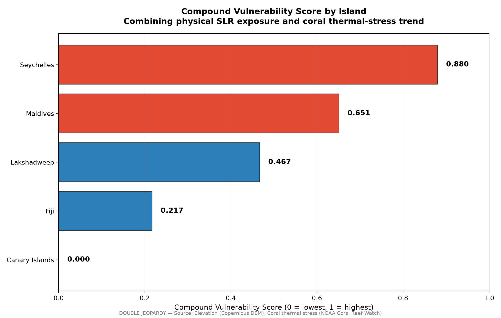

# Sakshi D. Maske
Independent Geospatial Researcher

## Abstract

Small island nations are widely assumed to face a compounding climate risk: high physical exposure to sea-level rise layered with degrading natural coastal defenses. This assumption is rarely tested against independent, multi-temporal evidence, and rarely disaggregated by ecosystem type. This study tests the compounding-vulnerability hypothesis across five island nations spanning three ocean basins — Maldives, Lakshadweep, Seychelles, Fiji, and the Canary Islands — treating mangrove and coral reef degradation as two independent pathways rather than a single undifferentiated category. Physical exposure was quantified from settlement-level elevation data; mangrove extent was tracked across three independent time points (1996, 2010, 2020); and coral condition was tracked using a continuous 24-year satellite-derived thermal-stress record. Coral reef systems show a measurable, rising bleaching-stress trend in four of five islands, most severely in Seychelles. Mangrove extent, tested with equal rigor, shows no measurable decline in any of the three islands where mangroves are present — a result that does not support the assumption of uniform ecosystem decline. Combining physical exposure with coral degradation into a composite vulnerability score reveals that the island with the highest physical exposure (Maldives) is not the island with the highest overall compound risk (Seychelles), demonstrating that exposure alone is an incomplete vulnerability measure. A supplementary test of whether formal protected-area coverage aligns with this empirically verified risk finds a positive but not statistically significant relationship, consistent with a small-sample limitation rather than a genuine absence of governance responsiveness. These findings indicate that coastal ecosystem degradation is not a uniform phenomenon across ecosystem types, with direct implications for how adaptation and conservation resources should be prioritized.

**Keywords**: sea-level rise, mangroves, coral bleaching, compound vulnerability, small island states, protected-area effectiveness, remote sensing

---

## 1. Introduction

International climate adaptation policy increasingly treats coastal ecosystems — mangroves, coral reefs, seagrass beds — as a single protective category, financed and managed under the umbrella term "nature-based solutions." A substantial body of research documents that these ecosystems genuinely do provide measurable coastal protection: reef structures dissipate wave energy before it reaches shore, and dense mangrove stands can reduce wave heights by well over half and, where wide enough, storm-surge peak water levels as well. Small island developing states are frequently identified as the setting where this protective value is proportionally greatest relative to national economic output.

What is less frequently tested is whether the ecosystems providing this protection are themselves degrading uniformly, or whether adaptation planning that treats them as a single undifferentiated buffer risks obscuring materially different underlying trajectories. This study addresses that gap directly, testing mangrove extent and coral reef condition as two independent pathways rather than assuming they move together, across a genuinely cross-national, multi-ocean-basin sample.

## 2. Literature Review

### 2.1 Nature-Based Coastal Protection and Its Assumed Uniformity

Coastal ecosystems are established in the literature as effective, measurable protective infrastructure. Reef structures have been shown to reduce incoming wave energy substantially, while mangrove belts of sufficient width can reduce wave heights and storm-surge peak levels meaningfully per kilometer of forest. Comparative work assessing corals, seagrasses, and mangroves together finds that combining multiple habitat types delivers more protection than any single habitat alone, and specifically cautions against the common practice of evaluating nature-based protection through a single-habitat lens rather than a whole-system approach — a caution directly relevant to this study's decision to test mangrove and coral trajectories independently rather than as one combined signal.

### 2.2 Global Mangrove Trends: A More Stable Picture Than Often Assumed

While mangrove loss driven by aquaculture and agricultural conversion is well documented across the twentieth century, the most comprehensive recent multi-decadal remote-sensing assessment — the Global Mangrove Watch archive's own change-detection analysis spanning 1996 to 2020 — found a global net loss of only approximately 3.4%, a considerably more modest figure than earlier deforestation-era estimates might suggest, indicating that mangrove loss has slowed substantially in the more recent multi-decade record relative to the mid-twentieth-century period. This finding is directly relevant to the present study's own result of no measurable mangrove decline across the three tested islands: rather than being an anomalous or surprising finding, it is broadly consistent with the direction, if not necessarily the exact magnitude, of the most authoritative recent global assessment of the same dataset this study draws from.

### 2.3 Coral Bleaching as a Distinct, Escalating Pathway

In contrast to the comparatively stable recent mangrove picture, coral bleaching driven by thermal stress is documented as increasing in both frequency and severity across recent decades, a trend attributed directly to rising ocean temperatures. NOAA Coral Reef Watch's satellite-derived Degree Heating Week product, the same metric used in this study, is established in the literature as a validated predictor of bleaching intensity, with values above 4°C-weeks associated with significant bleaching risk and values above 8°C-weeks associated with reef-wide bleaching and heat-sensitive coral mortality. The global coral reef system is, at the time of this study, in the midst of a fourth documented global bleaching event beginning in 2023, with bleaching confirmed across dozens of countries and all three major ocean basins — providing important real-world context for this study's finding of a rising thermal-stress trend in four of the five tested islands.

### 2.4 Protected-Area Effectiveness and the "Paper Park" Problem

A separate, substantial body of literature documents that formal protected-area designation frequently fails to translate into effective on-the-ground management, a phenomenon widely termed the "paper park" problem — protected areas that exist in legal or administrative terms without correspondingly effective enforcement, monitoring, or ecological outcomes. Recent global assessments estimate that while roughly ten percent of the ocean carries some form of formal protected status, only a small fraction of that area meets rigorous effectiveness standards. Identified drivers of this implementation gap include inadequate enforcement capacity, insufficient stakeholder engagement, and a persistent disconnect between protected-area evaluation findings and actual management action. This literature motivates the present study's governance-alignment test: rather than treating formal protection status as inherently meaningful, this study tests whether protected-area coverage is empirically aligned with independently verified ecological and physical risk, directly in the spirit of the paper-park critique.

## 3. Data and Methodology

### 3.1 Study Design

This study tests compound climate vulnerability across five island nations — Maldives, Lakshadweep, Seychelles, Fiji, and the Canary Islands — selected for their span across three distinct ocean basins and their geological diversity, ranging from low-lying coral atolls to volcanic, mountainous terrain. Two ecosystem pathways (mangrove extent, coral thermal condition) are tested independently rather than combined into a single assumed-uniform "ecosystem buffer" variable.

### 3.2 Data Sources

| Variable | Source | Temporal Coverage |
|---|---|---|
| Settlements, elevation | OpenStreetMap; Copernicus DEM GLO-30 | Current |
| Mangrove extent | Global Mangrove Watch | 1996, 2010, 2020 |
| Coral thermal stress | NOAA Coral Reef Watch (Degree Heating Week) | 1996–2020, continuous |
| Protected areas | World Database on Protected Areas | Current |
| Settlement/infrastructure change | Sentinel-2 (NDBI) | 2016 vs. 2024 |

### 3.3 Physical Exposure

Elevation was sampled at every settlement location across all five islands, and the proportion of settlements at or below a standard one-meter sea-level-rise threshold was calculated per island.

### 3.4 Mangrove Extent

Rather than relying on a single before/after comparison, mangrove area was independently measured at three time points (1996, 2010, 2020) in an equal-area projection, avoiding the distortion introduced by measuring change through raw polygon counts, which can vary with satellite classification segmentation behavior independent of any genuine change in underlying area.

### 3.5 Coral Thermal Stress

Coral condition was measured using the continuous Degree Heating Week time series rather than mapped physical extent, consistent with the understanding that coral degradation manifests primarily as thermally driven bleaching rather than area loss. An early reference period (1996–2000) was compared against a recent period (2016–2020) for each island.

### 3.6 Compound Vulnerability Score

Physical exposure and coral thermal-stress trend were normalized to a common 0–1 scale using min-max normalization and combined with equal weighting into a single Compound Vulnerability Score per island. Mangrove trend was not included as a weighted input, given the absence of any measurable decline to weight.

### 3.7 Governance Alignment

Protected-area coverage was quantified within a ten-kilometer coastal buffer around each island (rather than total captured extent, which for some islands included large offshore marine zones only loosely relevant to settlement-level risk) and tested against the Compound Vulnerability Score using a Pearson correlation.

## 4. Results

### 4.1 Physical Exposure

Settlement-level exposure to a one-meter sea-level-rise threshold ranged widely: 99.1% (Maldives), 78.3% (Seychelles), 77.8% (Lakshadweep), 32.0% (Fiji), and 12.1% (Canary Islands) — directly reflecting the underlying geological distinction between low-lying coral atoll nations and volcanic, mountainous terrain.

### 4.2 Mangrove Extent: No Measurable Decline

Across all three independent time points and all three islands with mangroves present, area remained essentially stable: Maldives (0.97 km² at all three points), Seychelles (3.83–3.84 km²), and Fiji (485.7 km² in 1996 to 488.4 km² in 2020, a net increase of 0.6%). This finding does not support the hypothesis that mangrove ecosystems in this sample are measurably declining.

### 4.3 Coral Thermal Stress: A Rising Trend

Comparing early-period and recent-period averages, four of five islands showed increasing thermal stress: Maldives (+0.17°C-weeks), Fiji (+0.10), Lakshadweep (+0.08), and Seychelles (+0.68, with a maximum single recorded value of 10.47°C-weeks — within the range associated with severe bleaching and multi-species mortality). The Canary Islands showed a slight decline (−0.05), consistent with its distinct Atlantic climate regime relative to the four Indian Ocean and Pacific islands.

### 4.4 Compound Vulnerability: Exposure Alone Is Insufficient

The composite score ranked Seychelles highest (0.880), followed by Maldives (0.651), Lakshadweep (0.467), Fiji (0.217), and Canary Islands (0.000). This directly demonstrates that physical exposure alone would misidentify the highest-risk island: Maldives has substantially higher exposure alone (99.1% versus 78.3%), yet Seychelles produces the higher composite score once its more severe coral degradation trend is incorporated.

  

**Figure 1.** Compound Vulnerability Score across the five study islands, combining normalized physical sea-level-rise exposure and long-term coral thermal-stress trend using equal weighting. Seychelles emerges as the most vulnerable island despite Maldives having the highest physical exposure alone, demonstrating that exposure by itself is an incomplete measure of climate vulnerability and reinforcing the need for a multi-indicator assessment framework.

### 4.5 Governance Alignment: Suggestive, Not Confirmatory

The correlation between compound vulnerability and coastal protected-area coverage was moderately positive (r=0.727) but did not reach conventional statistical significance (p=0.164), a result attributable to the study's necessarily small five-island sample rather than to an absence of any underlying relationship.

## 5. Discussion

The central finding — that ecosystem degradation is not uniform across type — is directly consistent with the divergent literature trajectories reviewed above: recent global mangrove assessments describe a comparatively modest net loss over the same multi-decade period this study examines, while coral bleaching literature describes an escalating, currently ongoing global event. The present study's island-level findings track these global patterns closely rather than diverging from them, lending external credibility to the results.

The governance-alignment finding, while not statistically significant, is directionally consistent with a growing literature documenting that protected-area coverage frequently fails to track genuine ecological risk — the "paper park" phenomenon. That Seychelles, the highest-vulnerability island in this sample, also carries the highest coastal protection ratio is a modestly encouraging signal against that broader pattern, though the small sample size means this cannot be treated as confirmed evidence of risk-responsive governance.

## 6. Limitations

The governance-alignment test is limited by a necessarily small five-island sample, providing insufficient statistical power to confirm a relationship that is nonetheless directionally positive. Lakshadweep population data could not be incorporated due to source-file constraints. The settlement-encroachment and cyclone-damage supporting analyses were each limited to a subset of islands by data availability rather than methodological choice, and are not generalized beyond the specific islands where they were tested.

## 7. Conclusion

This study finds that small island nations do face a compounding vulnerability to climate change, but that this compounding is neither uniform across ecosystem type nor adequately captured by physical exposure alone. Coral reef degradation is measurable and increasing across most of the sample; mangrove extent, tested with equal rigor across multiple independent time points, shows no comparable decline. The resulting implication for adaptation and conservation policy is direct: resources allocated under an assumption of uniform ecosystem risk may be systematically misallocated relative to where degradation is actually occurring.

## References

Duncan, C., et al. (2022). Global Mangrove Extent Change 1996–2020: Global Mangrove Watch Version 3.0. *Remote Sensing*, 14(15), 3657.

Ferrario, F., Beck, M. W., Storlazzi, C. D., Micheli, F., Shepard, C. C., & Airoldi, L. (2016). The effectiveness of coral reefs for coastal hazard risk reduction and adaptation. *Nature Communications*.

Guannel, G., Arkema, K., Ruggiero, P., & Verutes, G. (2016). The Power of Three: Coral Reefs, Seagrasses and Mangroves Protect Coastal Regions and Increase Their Resilience. *PLOS ONE*, 11(7).

Heron, S. F., Maynard, J. A., van Hooidonk, R., & Eakin, C. M. (2016). Warming Trends and Bleaching Stress of the World's Coral Reefs 1985–2012. *Scientific Reports*.

NOAA Coral Reef Watch. (2024). NOAA Confirms 4th Global Coral Bleaching Event.

Pieraccini, M., et al. (2017), as cited in: Marine Protected Areas and the Problem of Paper Parks.

Marine Conservation Institute. (2026). 10% Protected. 3% Effective. The Widening Gap We Can't Ignore.

Mapping Ocean Wealth. Coastal Protection: The Role of Mangroves and Coral Reefs.

---

**Full dataset, code, and reproducible pipeline**: [github.com/sakshimaske303-commits/DOUBLE-JEOPARDY](https://github.com/sakshimaske303-commits/DOUBLE-JEOPARDY)
**Live interactive dashboard**: *(link to be added upon deployment)*